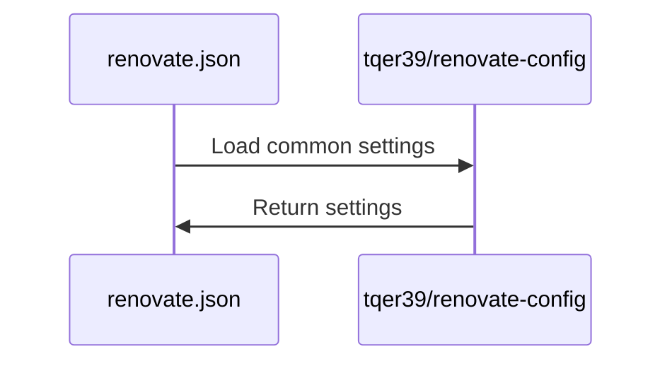

<p align="center">
  <a href="">
    
  </a>
  <h1 align="center">Renovate Config</h1>
</p>

<p align="center">
  <i>This repository is a repository that allows you to refer to and use Renovate configuration files from multiple repositories by consolidating them.</i>
</p>

---

## Usage

1. Create a `renovate.json` file in the root directory of your project.
2. Add the following settings to the `renovate.json` file.

```json
{
  "extends": [
    "github>tqer39/renovate-config"
  ]
}
```

## Customize settings for each repository

1. Create a `renovate.json` file in the root directory of your project.
2. Add the following settings to the `renovate.json` file.

```json
{
  "extends": [
    "github>tqer39/renovate-config"
  ],
  "packageRules": [
    {
      "packagePatterns": ["^@tqer39/"],
      "automerge": true
    }
  ]
}
```

### If you want to customize the common settings of this repository for your own use

1. Fork this repository.
2. Add the settings to the `renovate.json` file using the URL of the forked repository.

```json
{
  "extends": [
    "github>Your GitHub username/renovate-config"
  ]
}
```

## Processing contents



## Description of Renovate settings

The configuration file cannot be placed anywhere other than the root of the repository.

| File Name | Description |
| ----------- | ------------- |
| [automergeGitHubActions.json5](https://docs.renovatebot.com/configuration-options/#automerge) | Auto-merge settings for GitHub Actions |
| [automergeNodeEnv.json5](https://docs.renovatebot.com/configuration-options/#automerge) | Auto-merge settings for the Node.js environment |
| [automergePreCommit.json5](https://docs.renovatebot.com/configuration-options/#automerge) | Auto-merge settings for pre-commit |
| [automergePyEnv.json5](https://docs.renovatebot.com/configuration-options/#automerge) | Auto-merge settings for pyenv |
| [automergePython.json5](https://docs.renovatebot.com/configuration-options/#automerge) | Auto-merge settings for Python packages |
| [automergeSchedule.json5](https://docs.renovatebot.com/configuration-options/#schedule) | Schedule settings for auto-merging |
| [automergeStrategy.json5](https://docs.renovatebot.com/configuration-options/#automerge) | Strategy settings for auto-merging |
| [dependencyDashboard.json5](https://docs.renovatebot.com/configuration-options/#dependencydashboard) | Settings for the dependency dashboard |
| [major.json5](https://docs.renovatebot.com/configuration-options/#major) | Settings for major updates |
| [minor.json5](https://docs.renovatebot.com/configuration-options/#minor) | Settings for minor updates |
| [patch.json5](https://docs.renovatebot.com/configuration-options/#patch) | Settings for patch updates |
| [platformAutomerge.json5](https://docs.renovatebot.com/configuration-options/#automerge) | Auto-merge settings for platforms |
| [prHourlyLimit.json5](https://docs.renovatebot.com/configuration-options/#prhourlylimit) | Hourly limit settings for pull requests |
| [schedule.json5](https://docs.renovatebot.com/configuration-options/#schedule) | Schedule settings |
| [separateMajorMinor.json5](https://docs.renovatebot.com/configuration-options/#separatemajorminor) | Settings for separating major and minor updates |
| [separateMultipleMajor.json5](https://docs.renovatebot.com/configuration-options/#separatemultiplemajor) | Settings for separating multiple major updates |
| [timezone.json5](https://docs.renovatebot.com/configuration-options/#timezone) | Time zone settings |
| [vulnerabilityAlerts.json5](https://docs.renovatebot.com/configuration-options/#vulnerabilityalerts) | Vulnerability alert settings. This enables notifications if vulnerabilities are detected in dependencies. |

## Contribution

If you find any issues or have improvements, please create an Issue or submit a Pull Request.

## License

This project is licensed under the [MIT License](LICENSE).
