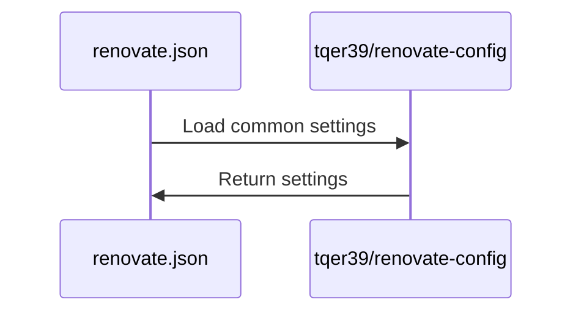

<p align="center">
  <a href="">
    
  </a>
  <h1 align="center">Renovate Config</h1>
</p>

<p align="center">
  <i>This repository is a repository that allows you to refer to and use Renovate configuration files from multiple repositories by consolidating them.</i>
</p>

---

## Usage

1. Create a `renovate.json` file in the root directory of your project.
2. Add the following settings to the `renovate.json` file.

```json
{
  "extends": [
    "github>tqer39/renovate-config"
  ]
}
```

## Customize settings for each repository

1. Create a `renovate.json` file in the root directory of your project.
2. Add the following settings to the `renovate.json` file.

```json
{
  "extends": [
    "github>tqer39/renovate-config"
  ],
  "packageRules": [
    {
      "packagePatterns": ["^@tqer39/"],
      "automerge": true
    }
  ]
}
```

### If you want to customize the common settings of this repository for your own use

1. Fork this repository.
2. Add the settings to the `renovate.json` file using the URL of the forked repository.

```json
{
  "extends": [
    "github>Your GitHub username/renovate-config"
  ]
}
```

## Processing contents



## Description of Renovate settings

The configuration file cannot be placed anywhere other than the root of the repository.

| File Name | Description |
| --------- | ----------- |
| [default.json](./default.json) | Entry point for external repositories. Extends `renovate.json5`. |
| [renovate.json5](./renovate.json5) | Main configuration file containing all Renovate settings. |

### Main configuration options in `renovate.json5`

| Option | Description |
| ------ | ----------- |
| `timezone` | Time zone setting (Asia/Tokyo) |
| `schedule` | Update check schedule (weekends 0:00-6:00) |
| `automerge` | Auto-merge settings for PRs |
| `automergeSchedule` | Auto-merge schedule (weekdays 0:00-6:00) |
| `automergeStrategy` | Merge strategy (squash) |
| `platformAutomerge` | Enable platform-level auto-merge |
| `separateMajorMinor` | Separate major and minor update PRs |
| `dependencyDashboard` | Enable dependency dashboard |
| `vulnerabilityAlerts` | Security vulnerability alert settings |
| `packageRules` | Package-specific rules for GitHub Actions, Node.js, Python, etc. |

## Contribution

If you find any issues or have improvements, please create an Issue or submit a Pull Request.

## License

This project is licensed under the [MIT License](LICENSE).
