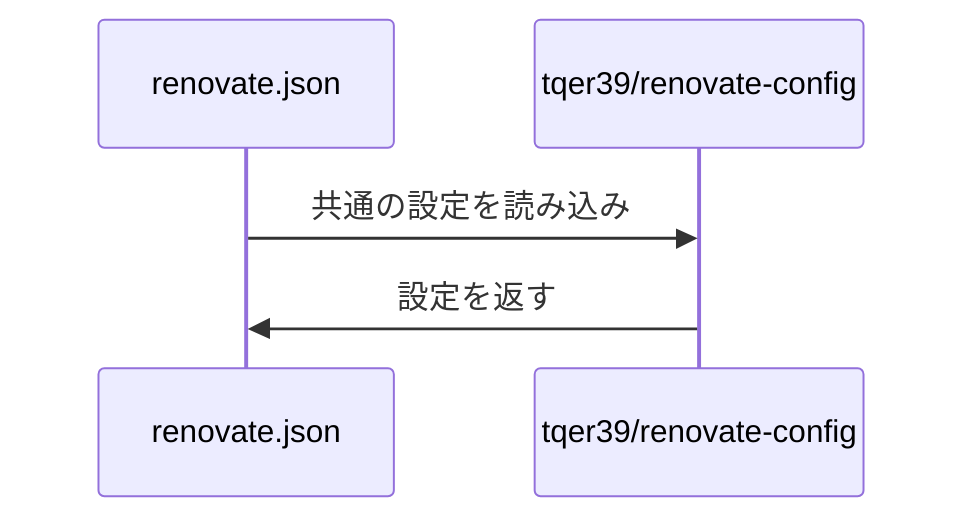

<p align="center">
  <a href="">
    
  </a>
  <h1 align="center">Renovate Config</h1>
</p>

<p align="center">
  <i>このリポジトリには、依存関係の更新ツールである Renovate の設定ファイルを共通化してまとめて置くことで複数のリポジトリから参照して使用することが可能なリポジトリです。</i>
</p>

## 使い方

1. プロジェクトのルートディレクトリに `renovate.json` ファイルを作成します。
2. 以下のように `renovate.json` ファイルに設定を追加します。

```json
{
  "extends": [
    "github>tqer39/renovate-config"
  ]
}
```

## リポジトリごとに設定をカスタマイズする場合

1. プロジェクトのルートディレクトリに `renovate.json` ファイルを作成します。
2. 以下のように `renovate.json` ファイルに設定を追加します。

```json
{
  "extends": [
    "github>tqer39/renovate-config"
  ],
  "packageRules": [
    {
      "packagePatterns": ["^@tqer39/"],
      "automerge": true
    }
  ]
}
```

### このリポジトリの共通設定を自分用にカスタマイズして使う場合

1. このリポジトリをフォークします。
2. フォークしたリポジトリの URL を使って `renovate.json` ファイルに設定を追加します。

```json
{
  "extends": [
    "github>あなたのGitHubユーザー名/renovate-config"
  ]
}
```

## 処理内容



## renovate 設定の説明

設定ファイルはリポジトリのルート以外では配置できません。

| ファイル名 | 説明 |
| --------- | ----------- |
| [default.json](../default.json) | 外部リポジトリ用のエントリーポイント。`renovate.json5` を extends します。 |
| [renovate.json5](../renovate.json5) | すべての Renovate 設定を含むメイン設定ファイル。 |

### `renovate.json5` の主要な設定項目

| オプション | 説明 |
| ------ | ----------- |
| `timezone` | タイムゾーン設定 (Asia/Tokyo) |
| `schedule` | 更新チェックのスケジュール (週末 0:00-6:00) |
| `automerge` | PR の自動マージ設定 |
| `automergeSchedule` | 自動マージのスケジュール (平日 0:00-6:00) |
| `automergeStrategy` | マージ戦略 (squash) |
| `platformAutomerge` | プラットフォームレベルの自動マージを有効化 |
| `separateMajorMinor` | メジャーとマイナーの更新 PR を分離 |
| `dependencyDashboard` | 依存関係ダッシュボードを有効化 |
| `vulnerabilityAlerts` | セキュリティ脆弱性アラート設定 |
| `packageRules` | GitHub Actions、Node.js、Python などのパッケージ固有ルール |

## 貢献方法

問題や課題が発見されたら Issue を作成するか Pull Request を作成していただけると幸いです。

## ライセンス

このプロジェクトは [MIT ライセンス](LICENSE) の下でライセンスされています。
