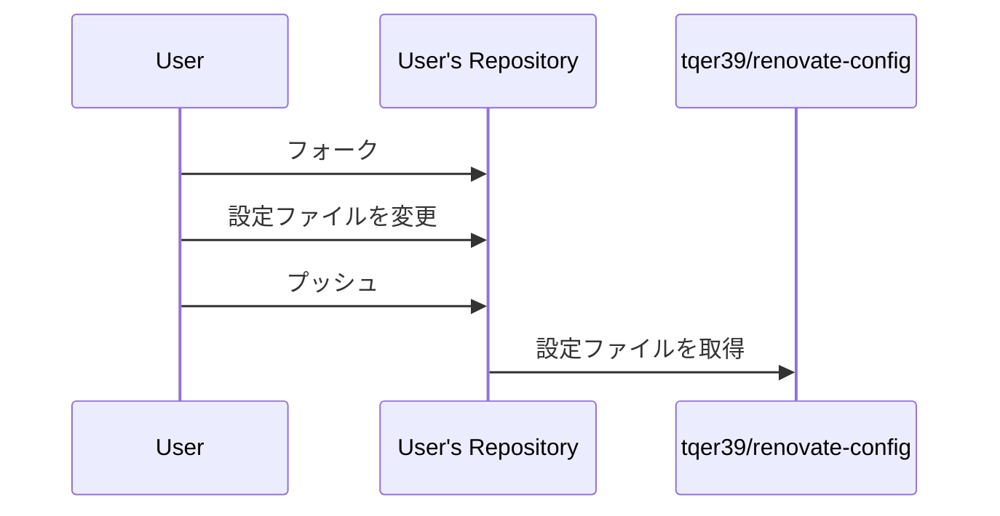

# renovate-config

このリポジトリには、依存関係の更新ツールである Renovate の設定ファイルが含まれています。Renovate は、プロジェクトの依存関係を最新のバージョンに保つプロセスを自動化するのに役立ちます。

## 動作方法

1. このリポジトリを自分の GitHub アカウントにフォークします。
2. フォークしたリポジトリで共通の Renovate 設定を定義します。
3. プロジェクトの `renovate.json` ファイルで、フォークしたリポジトリの設定を参照します。

## 処理内容

## settings/ ファイルの説明

| ファイル名 | 説明 |
|------------|------|
| [automergeGitHubActions.json](https://docs.renovatebot.com/configuration-options/#automerge) | GitHub Actions の自動マージ設定 |
| [automergeNodeEnv.json](https://docs.renovatebot.com/configuration-options/#automerge) | Node.js 環境の自動マージ設定 |
| [automergePreCommit.json](https://docs.renovatebot.com/configuration-options/#automerge) | pre-commit の自動マージ設定 |
| [automergePyEnv.json](https://docs.renovatebot.com/configuration-options/#automerge) | pyenv の自動マージ設定 |
| [automergePython.json](https://docs.renovatebot.com/configuration-options/#automerge) | Python パッケージの自動マージ設定 |
| [automergeSchedule.json](https://docs.renovatebot.com/configuration-options/#schedule) | 自動マージのスケジュール設定 |
| [automergeStrategy.json](https://docs.renovatebot.com/configuration-options/#automerge) | 自動マージの戦略設定 |
| [dependencyDashboard.json](https://docs.renovatebot.com/configuration-options/#dependencydashboard) | 依存関係ダッシュボードの設定 |
| [major.json](https://docs.renovatebot.com/configuration-options/#major) | メジャーアップデートの設定 |
| [minor.json](https://docs.renovatebot.com/configuration-options/#minor) | マイナーアップデートの設定 |
| [patch.json](https://docs.renovatebot.com/configuration-options/#patch) | パッチアップデートの設定 |
| [platformAutomerge.json](https://docs.renovatebot.com/configuration-options/#automerge) | プラットフォームの自動マージ設定 |
| [prHourlyLimit.json](https://docs.renovatebot.com/configuration-options/#prhourlylimit) | プルリクエストの時間あたりの制限設定 |
| [schedule.json](https://docs.renovatebot.com/configuration-options/#schedule) | スケジュール設定 |
| [separateMajorMinor.json](https://docs.renovatebot.com/configuration-options/#separatemajorminor) | メジャーとマイナーの分離設定 |
| [separateMultipleMajor.json](https://docs.renovatebot.com/configuration-options/#separatemultiplemajor) | 複数のメジャーアップデートの分離設定 |
| [timezone.json](https://docs.renovatebot.com/configuration-options/#timezone) | タイムゾーンの設定 |
| [vulnerabilityAlerts.json](https://docs.renovatebot.com/configuration-options/#vulnerabilityalerts) | 脆弱性アラートの設定。これにより、依存関係に脆弱性が発見された場合に通知を受け取ることができます。 |

## 貢献方法

問題や課題が発見されたら Issue を作成するか Pull Request を作成していただけると幸いです。

## ライセンス

このプロジェクトは [MIT ライセンス](LICENSE) の下でライセンスされています。
